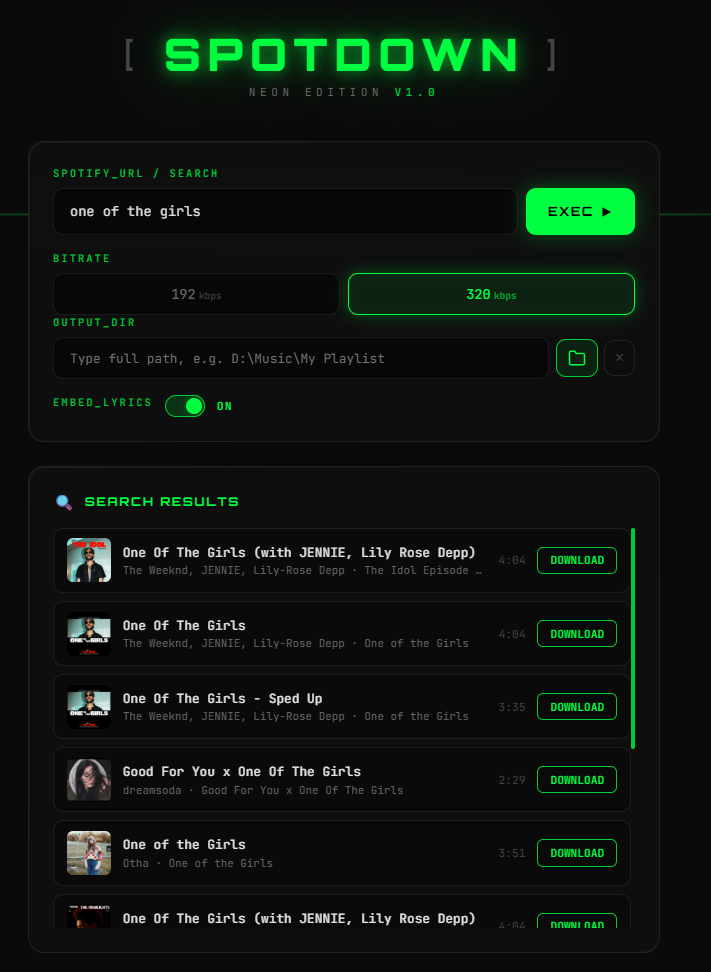

<h1 align="center">[ SPOTDOWN ]</h1>

<p align="center">
  <b>Self-hosted Spotify downloader with a cyberpunk neon UI</b><br>
  <sub>Search songs by name • Download tracks, albums & playlists • Full metadata embedding</sub>
</p>

<p align="center">
  
  
  
  
</p>

---

## Features

| Feature | Description |
|---------|-------------|
| **Search & Download** | Type a song name, browse results with cover art, click download — no URL needed |
| **URL Download** | Paste any Spotify track, album, or playlist URL |
| **Album Numbering** | Album tracks auto-numbered: `01.Song - Artist.mp3` |
| **Full Metadata** | Title, artist, album, cover art, track number embedded in ID3v2.3 |
| **Lyrics Embedding** | Synced + plain lyrics from lrclib, lyrics.ovh, lyrics.fandom |
| **Retry Failed** | One-click retry on individual tracks or all failures at once |
| **Stop & Resume** | Pause and continue downloads without losing progress |
| **Duplicate Detection** | Skips already-downloaded tracks automatically |
| **Bitrate Control** | Choose between 192 or 320 kbps |
| **Custom Output** | Pick any folder on your system via path input or folder browser |

## Preview

<p align="center">
  
</p>

## Quick Start

### Prerequisites

- **Python 3.10+**
- **FFmpeg** (must be in PATH)
- **yt-dlp** (`pip install yt-dlp`)

### Install & Run

```bash
git clone https://github.com/mahdim43/spotify-downloader.git
cd spotify-downloader
pip install -r requirements.txt
python -m uvicorn main:app --host 127.0.0.1 --port 8000
```

Open **http://localhost:8000** in your browser.

## Usage

### Search Mode
1. Type a song name or artist (e.g. `Bohemian Rhapsody`)
2. Press **EXEC** or hit Enter
3. Browse search results with cover art, artist, album, duration
4. Click **DOWNLOAD** on any result

### URL Mode
1. Paste a Spotify URL (`https://open.spotify.com/track/...`)
2. Select bitrate (192/320 kbps)
3. Click **EXEC**
4. Monitor real-time progress via SSE

### Album Downloads
- Tracks are numbered automatically: `01.Song - Artist.mp3`
- Album cover art is applied to all tracks
- Duplicate tracks are skipped on re-download

### Failed Tracks
- Click **RETRY** on individual failed tracks
- Or click **RETRY ALL FAILED** for bulk retry
- Retried tracks preserve correct album numbering

## Tech Stack

| Layer | Technology |
|-------|-----------|
| Backend | Python, FastAPI, uvicorn |
| Frontend | Vanilla JS, CSS3 (Neon/Cyberpunk theme) |
| Download | yt-dlp + FFmpeg |
| Metadata | Mutagen (ID3v2.3) |
| Search | spotify_scraper (no API credentials needed) |
| Progress | Server-Sent Events (SSE) |

## API Endpoints

| Method | Path | Description |
|--------|------|-------------|
| `POST` | `/api/search` | Search Spotify tracks by name |
| `POST` | `/api/download` | Start a download job |
| `POST` | `/api/stop/{id}` | Stop a running job |
| `POST` | `/api/resume/{id}` | Resume a stopped job |
| `POST` | `/api/retry/{id}` | Retry failed tracks |
| `GET` | `/api/progress/{id}` | SSE progress stream |
| `GET` | `/api/health` | Health check |

## Configuration

Create a `.env` file (optional):

```env
DOWNLOAD_DIR=./downloads
HOST=127.0.0.1
PORT=8000
MAX_CONCURRENT_DOWNLOADS=5
```

## License

MIT
